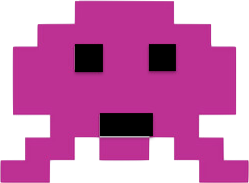

# Space-Invaders
Shoot down aliens in space
## How to play on your browser
Go to ajstrizzy.github.io (online hosted version is currently bugged, only playable through cloning to you local system)
## Steps to install on local computer
1. Go to [repo](https://github.com/AJStrizzy/space-invaders) on Github profile
2. `fork` and `clone` repo
3. Clone to local machine
```text
git clone https://github.com/AJStrizzy/space-invaders.git
```
4. Go to `space-invaders` directory
5. Open `index.html` in browser
```text
open index.html
```

```text
This was my first project done during my software engineering course with General Assembly. This project was done during
the duration of the 3rd week of the course. During the 1st and 2nd weeks of the course we learned about HTML, CSS and 
Javascript and how they all interact with eachother. This project was our first attempt at putting what we had learned so 
far to use, and create something.

I attempted to make a recreation of the classic arcade game, Space Invaders. If anyone reading this isn't familiar with 
the game, here is a link to what the orginal game was like.
```
[Space Invaders Video](https://www.youtube.com/watch?v=D1jZaIPeD5w)

```text
Since this was my first project ever, there was a lot of trial and error involved and a TON of time put into this. I think 
I finally got it to where I'm happy to leave it and all the bugs have been worked out. 

If you discover or run into any bugs, please feel free to send me a message through github and let me know. My github username is AJStrizzy. Any feedback is much appreciated.

This was the initial wire frame/ outline for how I wanted the game to come out.
```


```text
Now give it a shot for yourself and see how it all came together!!! 


Game Instructions:

Safely navigate your space ship through 4 hordes of space aliens to finally reach the alien ship. 
Defeat the alien ship and save the galaxy!

Controls:
Left arrow key to move ship to the left.
Right arrow key to move ship to the right.
'a' key to shoot projectiles


How to finish a level:
Clear screen of all aliens to proceed to following level.
On final level defeat the alien ship to finish the game

Be careful!:
The player starts with 3 health points.
Each enemy projectile will deplete one health point from the player. If all 3 health points are depleted the game ends.
If any of the aliens or alien ship reach the player, the game will end.
If any of the aliens make it past the player and to the bottom of the screen the game will end.

Powerups:
Collect hearts to regain lost health. Each heart is worth one health point
Collect stars to activate a 5 second fire speed increase
```


```html
<div id="container">
            <aside id="top-left"><h2 id = "game-score">Score:0</h2></aside>
            <aside id="top-right"><h2 id = "game-lives">❤ ❤ ❤</h2></aside>
            <main>
                <canvas id="game"></canvas>
            </main>
            <aside id="btm-left"><h2 id= "game-start">Start Game</h2></aside>
            <aside id="btm-right"><h2>Ship Controls<br>Left Arrow: Move Left<br>Right Arrow: Move Right<br> "A" Key: Shoot</h2></aside>
          </div>
          
          
          
          
          
          
          
          


          <audio src="FinalFinal.wav" id = "enemy-hit"></audio>
          <audio src="Game Over.mp3" id = "game-over"></audio>
          <audio src="Fire.mp3" id = "fire"></audio>
          <audio src="startup.wav" id = "start-sound"></audio>
          <audio src="Game-win.wav" id = "win-sound"></audio>
          <audio src="Background.mp3" id = "back-sound"></audio>
          <audio src="alien shooting.mp3" id = "enemy-sound"></audio>
          <audio src="Damage.mp3" id = "player-damage"></audio>
          <audio src='healthsound.wav' id ="healthsound"></audio>
          <audio src='boostup.wav' id ="boostup"></audio>
          <audio src='boostdownsound.wav' id ="boostdown"></audio>
          <audio src= 'bossSound.wav' id = 'bossSound'></audio>

```
Sets up game display, and links all needed sound effects and images to the document.

```css
canvas {
    background-color: black;
    width: 100%;
    height: 100%;
    background-image: url("bg.jpg")
  }
  #container {
  height: 600px;
  width: 550px;
  background-color: silver;
  margin: 0 auto;
  padding: .3em;
  display: grid;
  grid-gap: .4em;
  grid-template-rows: .13fr .70fr .17fr;
  grid-template-columns: .35fr .15fr .25fr .25fr;
  grid-template-areas: "top-left top-left top-right top-right"
                        "game game game game"
                        "btm-left btm-right btm-right btm-right";
  }
```
Adds the style and grid layout for the game board and canvas.

```javascript
document.getElementById('game-start').addEventListener('click', function(){
    if(document.getElementById('game-start').textContent === 'Start Game') {
        startGame()
    } else if (document.getElementById('game-start').textContent === 'Try Again') {
        reset()
    } else if (document.getElementById('game-start').textContent === 'Next Level' && level <= 3) {
        levelUp()
    } else if (document.getElementById('game-start').textContent === 'Next Level' && level === 4) {
        bossLevel()
    } else if (document.getElementById('game-start').textContent === 'Play Again' && level === 5) {
        playAgain()
    }
    })
```
Provides logic for game to run the proper function per level when start button is clicked.

```javascript
 document.addEventListener('keydown', function(evt) {
    if (evt.key === 'ArrowRight' && player.x < 495 && player.speed === 0 && gmLive === 1) {
        player.speed += 2.5
    } else if (evt.key === 'ArrowLeft' && player.x > 2 && player.speed === 0 && gmLive === 1)  {
        player.speed -= 2.5
    } else if (evt.key === 'ArrowLeft' && player.x > 2 && player.speed > 0 && gmLive === 1)  {
        player.speed *= -1
    } else if (evt.key === 'ArrowRight' && player.x < 495 && player.speed < 0 && gmLive === 1)  {
        player.speed *= -1
    } 
})
```
Allows movement for player and ties left and right movement to the arrow keys.

```javascript
function rePaint() {
    ctx.clearRect(0, 0, game.width, game.height)
    

    if(player.alive === true) {
        player.render()
    }
    if(arrAliens !== 0 && alienRender === 1) {
    arrAliens.forEach(function (par){
        par.render()
    })
}
    if(arrBullets !== 0){
    arrBullets.forEach(function (par) {
        par.render()
    })
}
    if(arrAlienBullets !== 0) {
    arrAlienBullets.forEach(function (par) {
        par.render()
    })
    }
    if(arrHearts !== 0) {
        arrHearts.forEach(function (par){
            par.render()
        })
    }

    if(arrBoost !== 0) {
        arrBoost.forEach(function (par){
            par.render()
        })
    }

    
    

    healthUp()
    boostUp()
    bulletBoundaries()
    boundaries()
    changeDirection()
    alienBoom()
    scoreUpdate()
    playerBoom()
    playerDamage()
    playerDeath()
}
```
Function that sets up entire game. This function is run 60 times per second to constantly update the game screen.
  